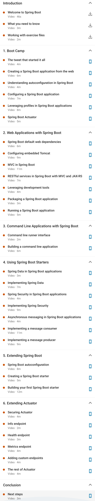

## Spring Boot Essentials

This repository contains following topics:
  
    - Creating a Spring Boot application
    - Configuring a Spring Boot app
    - Leveraging profiles
    - Packaging and running Spring Boot web apps
    - Building a command-line application
    - Using Spring Boot starters: Spring Data, Spring Security, and more
    - Extending Spring Boot
    - Using Spring Boot Actuator to monitor app health and other metrics

### Course Content
